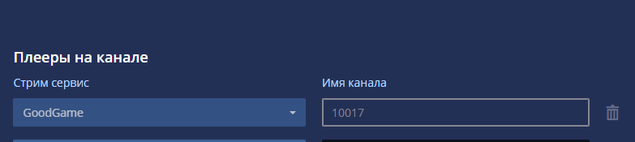
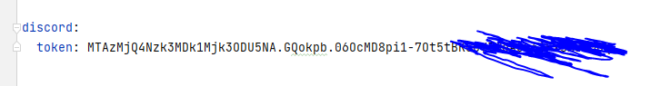

# Chatbot Dogen 🐕

## Описание

Приложение-клиент к чату стрима на Goodgame.ru.

## Требования

* Java 17
* Maven 3.8.5

## Использование

Для обработки входящих сообщений нужно реализовать компонент следующего типа:

```java

@Component
public class MyHandler extends MessageHandler {

    @Override
    public ReqGgMessage answerMessage(RespGgMessage message, String text, String lowerCase) {
        if (lowerCase.contains("!моя команда")) {
            return createUserMessage(message, "мой ответ");
        }
        return null;
    }
}
```

## Настройка

Настройка приложения осуществляется через application.yml файл. Нужно переименовать файл application.yml-default и
заполнить поля:

```yaml
auth:
  login: gg_login
  password: gg_password

checked-channels: 10017
```

Где

* login и password - логин и пароль с goodgame.ru
* checked-channels имя канала из настроек
  

## Запуск

Запустить можно из Intellij IDEA или собрав запустить из jar файла. Пример команды запуска на linux:

```shell
nohup /usr/lib/jvm/java-17/bin/java -jar -Xrunjdwp:server=y,transport=dt_socket,address=8000,suspend=n  -Dspring.config.location=application.yml -Dlogging.config=logback.xml chatbot-release.jar &
```

Где

* /usr/lib/jvm/java-17/bin/java - к установленной java 17.
* -Dspring.config.location - путь к application.yml. В проекте лежит под названием application.yml-default.
* -Dlogging.config - путь к logback.xml - файл настройки логирования. В проекте лежит под названием logback.xml.default

## Discord bot example:

